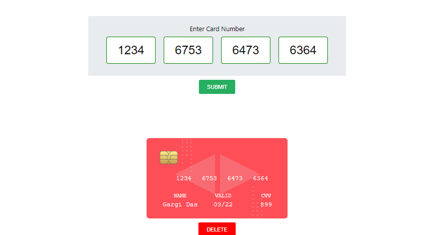
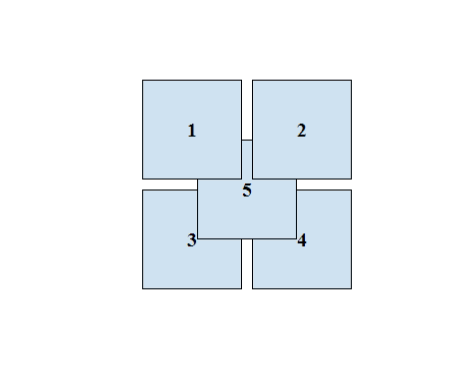

# MERN TASK MASAI 
<table>
   <tr align=center>
     <td  colspan=3>Task 1 </td>
  </tr>
   <tr align=center>
     <td  colspan=3>Task 2 </td>
  </tr>
</table>

### `Functionalities`

- Task-1(frontend) : User can add credit card number and can create a number of list of the credit card
- Task-2(frontend) :User can click any boxes and it will show about of all the boxes.
- Task-3(backend) :User can able to able to register,login,get child data,post child data,get state state,post state data,add district data & post district data using the routes.

### `Installation and Setup Instructions`

Clone down this repository. You will need `node` and `npm` installed globally on your machine.
Installation:(both for frontend(task-1) and backend)
`npm install`
To Run Test Suite:
`npm test`
To Start Server:(for frontend task-1)
`npm start`
To Visit App:(task-1 frontend)
`localhost:3000/`

#### FRONTEND

- `React`
  To learn React, check out the [React documentation](https://reactjs.org/).
  
#### BACKEND

- `npm install`
- `nodemon server.js`

## Acknowledgments

- I take all the responsiblity for every single line of code.

